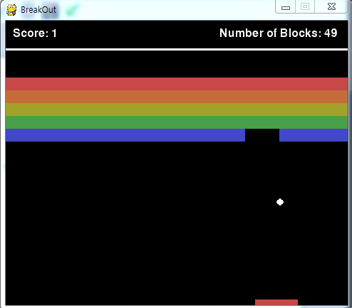
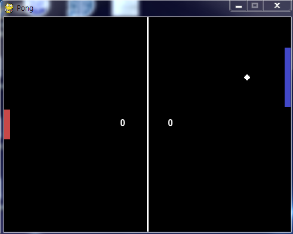
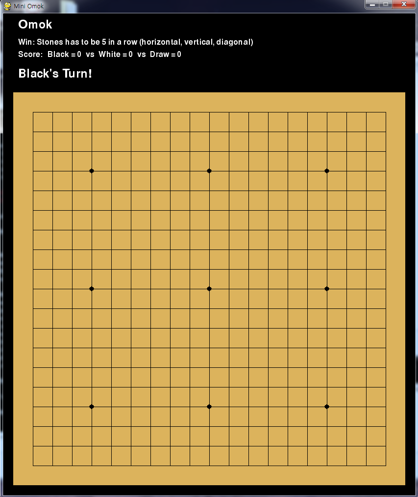
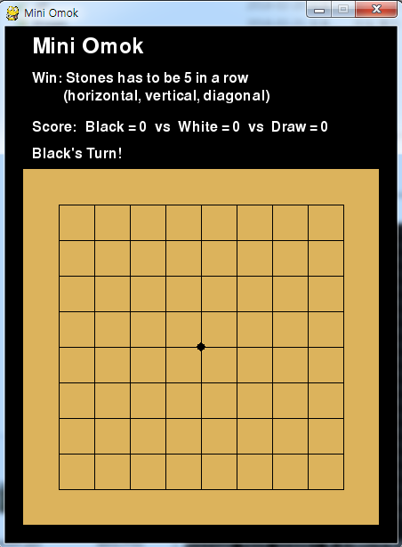
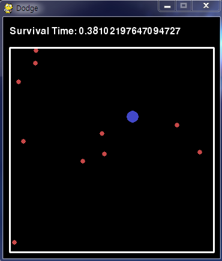

# Pygame

## Introduction
This repository is the codes for games which is made by python library `pygame`

The games that I implemented is as follows.

- breakout
- pong
- omok
- mini-omok
- dodge

---

## Games

### Breakout

This game is famous breakout game from Atari. 

The **goal** of this game is to break all the blocks! 

Red agent at the bottom has to hit the white ball to break the blocks. 

You can control the agent with 3 keys (left, down, right)

- Left: Agent goes left
- Right: Agent goes right
- Down: Agent stays at the position 

---

### Pong

This game is famous pong game of Atari. 

The **goal** is to make the ball goes to the right side of the screen!

However, in my version, the enemy is invincible..  

Red agent at the left has to hit the white ball not to lose. 

You can control the agent with 3 keys (left, down, right)

- Left: Agent goes up
- Right: Agent goes down
- Down: Agent stays at the position 

---

### Omok

Omok is popular game in Korea which uses go board (19 x 19). 

The **goal** of this game is to make stone 5 in a row (Horizontal or vertical or diagonal)!

You can use your mouse to put stones on the board 

---

### Mini-Omok

Mini Omok is mini version of omok (9 x 9). 

The **goal** of this game is to make stone 5 in a row (Horizontal or vertical or diagonal)!

You can use your mouse to put stones on the board.

---

### Dodge

This game is my own simple game. 

The **goal** is to evade all the red dots and survive!

Blue circle is agent and red dot is enemy.

If enemy hits agent, agent lose the game 

You can control the agent with 4 keys (up, down, left, right)

- Left: Agent goes left
- Right: Agent goes right
- Down: Agent goes down
- Up: Agent goes up 